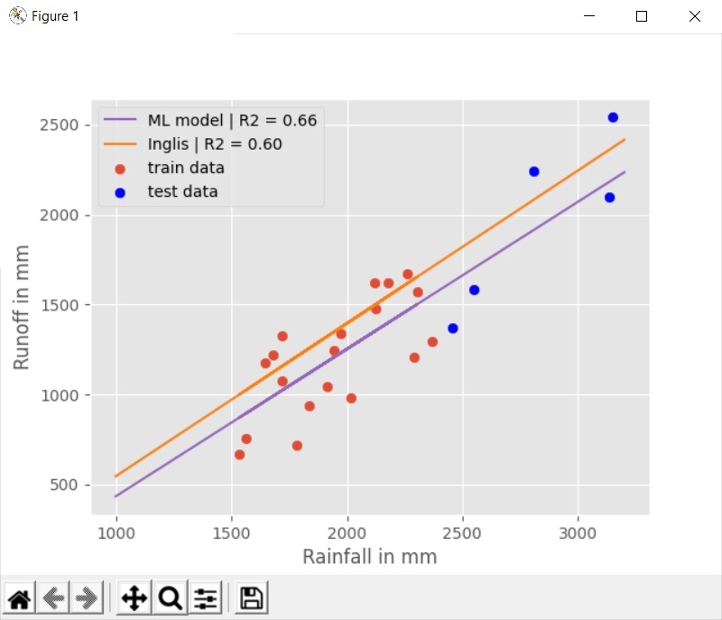

# runoff-prediction
Predicting the runoff of Ozarkhed catchment using a linear regression model trained on past rainfall data and verifying the results against the Inglis model.

The Table_extractor.py module extracts the table as a dataframe from the pdf dataset (It's just included to show how it's done...the actual predicting module doesn't use the module).

The Rainfall_Models_python.py file is the main file which predicts the runoff values and measures its performance against the traditional Inglis model.

A plot of the two models along with their R square values  is shown below:

